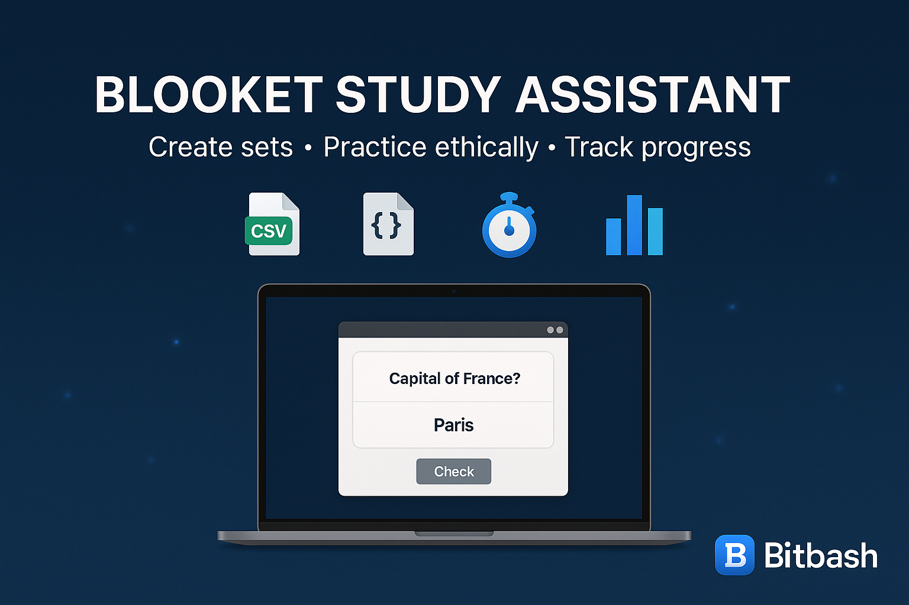

#  Blooket Bot – Automate Gameplay & Points Collection

<p align="center"> <a href="https://github.com/yourusername/facebook-bot">  </a> </p>

<p align="center">
  <a href="https://discord.gg/vBu9huKBvy">
    
  </a>
  <a href="https://t.me/devpilot1">
    
  </a>
</p>

---

##  Overview

**Blooket Bot** automates tasks in Blooket games, helping students, teachers, and gamers maximize points and manage gameplay efficiently.  
It runs in the background, simulating human-like actions for safety and speed.

### Key Benefits:
- **Auto Answer Questions**: Quickly and accurately answer quizzes.  
- **Point Collection**: Efficiently earn points across multiple sessions.  
- **Multi-Account Support**: Manage several accounts simultaneously.  
- **Human-Like Interaction**: Randomized delays and pacing to avoid detection.  
- **Game Mode Automation**: Supports Tower Defense, Racing, Cafe, and more.  
- **Logging & Analytics**: Track actions and performance for each session.  
- **Background Operation**: Runs silently without supervision.  

---

##  Core Features

| **Feature**                   | **Description**                                                                                   |
|--------------------------------|--------------------------------------------------------------------------------------------------|
| **Auto Answer Questions**      | Automatically answer quiz questions with configurable accuracy and randomization.               |
| **Point Collection**           | Efficiently earn points in all game modes.                                                      |
| **Multi-Account Support**      | Handle multiple Blooket accounts at once.                                                      |
| **Human-like Timing**          | Random delays and pacing to mimic real players.                                                |
| **Game Mode Automation**       | Works across Tower Defense, Racing, Cafe, and other Blooket modes.                              |
| **Logging & Reports**          | Record session performance and actions for monitoring.                                         |
| **Background Operation**       | Run in the background without needing constant supervision.                                     |
| **Customizable Settings**      | Adjust behavior per game mode, question type, or points target.                                 |

---

<p align="center">
  
</p>

##  Target Audience

- Students participating in Blooket games  
- Teachers managing classroom sessions  
- Gamers looking to optimize points collection  
- Developers exploring educational game automation  

---

##  Contact

- 💬 [Join Discord Community](https://discord.gg/vBu9huKBvy)  
- 📱 [Contact via Telegram](https://t.me/devpilot1)  

---

##  Installation Instructions

### 1. Clone the Repository
```bash
git clone https://github.com/yourusername/blooket-bot.git
cd blooket-bot
